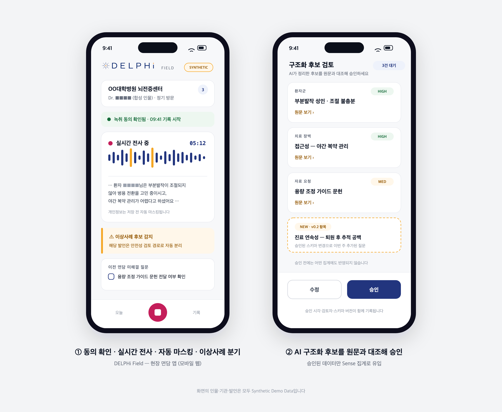
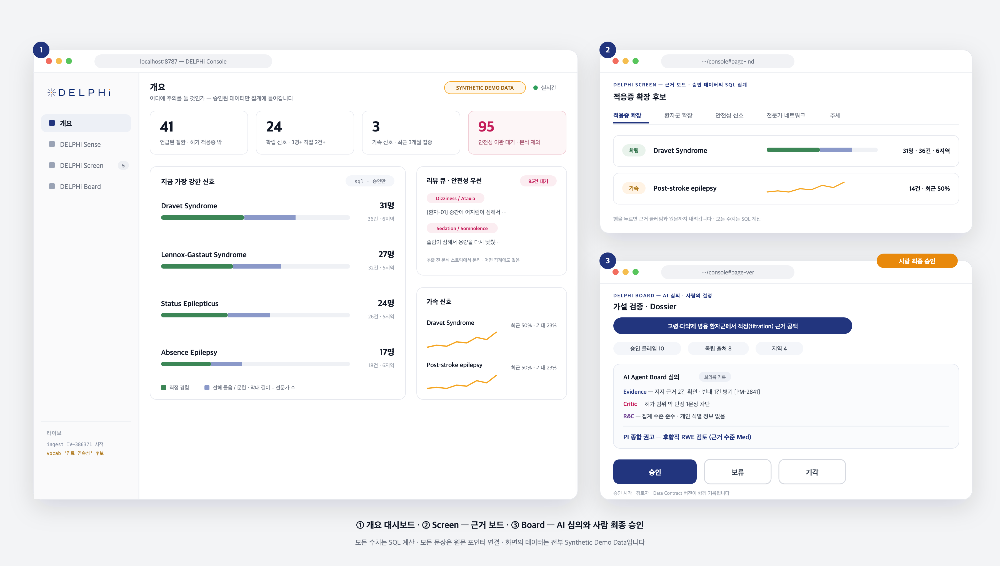

<div align="center">


**Adaptive Data Foundation for Growth Intelligence for XCOPRI®**


</div>

---

## 개요

DELPHi는 사내 비정형 데이터를 원문 근거가 연결된 데이터로 바꾸고, 그 데이터에서 찾은 신호를 외부 과학 근거와 맞춰본 뒤 사람이 승인하는 XCOPRI 성장 지원 플랫폼입니다.

이름은 고대 델포이와 Delphi method에서 가져왔습니다. 여러 전문가의 의견을 반복해서 모아 판단을 구조화하는 방식처럼, DELPHi도 흩어진 신호와 서로 다른 관점을 정리합니다. 다만 결론만 남기지 않고 그 근거와 반대 의견까지 함께 남깁니다.

## 문제

데이터는 쌓이지만 다시 쓸 수 있는 형태로 축적되지 않습니다. 면담 기록, Medical Information 문의, 회의록은 담당자마다 다른 형식과 표현으로 저장됩니다. 그래서 같은 이야기가 몇 번 반복되었는지 셀 수 없고, 분석이 필요할 때마다 사람이 문서를 다시 읽어야 합니다. 한 번 정리해도 새 기록이 다시 자유서술로 쌓이면 같은 일을 반복하게 됩니다.

XCOPRI의 다음 성장 신호는 이미 면담과 문서, 논문과 임상 데이터 안에 있습니다. 문제는 정보가 부족한 게 아니라, 그 정보들이 서로 연결되지 않는다는 것입니다. DELPHi가 줄이려는 것은 기록이 생긴 시점부터 그것이 근거와 우선순위를 갖춘 판단 재료로 조직에 인지되기까지의 시간입니다.

## 구성


**Sense — 구조화**
비정형 문서를 의미 단위로 나누고 정해진 스키마에 맞춰 구조화합니다. 모든 값에는 원문 위치가 함께 저장됩니다. 승인된 데이터만 SQL로 집계해 반복 횟수와 추이를 계산하고, 여기서 성장 가설 후보를 뽑습니다. 기존 스키마로 담기지 않는 개념이 반복되면 자동으로 반영하지 않고 스키마 변경안으로 제안합니다.

**Screen — 근거 검증**
가설을 PubMed, ClinicalTrials.gov, 공개된 허가·안전성 자료와 맞춰봅니다. 역할이 다른 AI 에이전트가 지지 근거와 반대 근거, 그리고 아직 근거가 없는 부분을 각각 정리합니다. 근거 없는 주장이나 허가 범위를 벗어난 단정은 검증 담당 에이전트가 걸러내고 그 기록을 남깁니다.

**Board — 심의와 승인**
관점이 다른 AI 에이전트가 가설을 심의하고 최종 권고를 정리합니다. 사실과 통계, AI의 해석, 전략 제안은 섞지 않고 구분해서 보여줍니다. 승인 권한은 사람에게 있고, 승인·보류·기각과 그 이유는 모두 기록으로 남습니다.

**Field — 현장 수집**
모바일에서 면담 내용을 기록합니다. 동의를 확인한 뒤 녹음이나 텍스트로 기록하면 개인정보를 가린 전사가 만들어지고, 부작용을 시사하는 내용은 일반 분석과 분리해 안전성 경로로 보냅니다. AI가 만든 구조화 후보는 원문 인용과 함께 카드로 보여주고, 사용자가 확인해 승인한 값만 저장됩니다. 입력 항목은 코드에 고정되어 있지 않고 승인된 스키마에서 그때그때 만들어집니다.

이 네 가지가 하나의 스키마를 공유하기 때문에 루프가 닫힙니다. 과거 데이터 분석에서 나온 스키마 변경안이 승인되면, 그 구조가 다음 현장 기록의 입력 항목으로 바로 적용됩니다.

## 작동 방식

**Data Contract**
어떤 정보를 어떤 항목과 규칙으로 저장할지 정리한 문서이자 설정 파일입니다. 하나의 정의를 AI 추출 스키마, 서버 검증, DB 구조, Field 입력 폼, 대시보드 집계 기준, 에이전트 입력 형식이 함께 씁니다. AI는 이 파일을 스스로 바꿀 수 없습니다. 원문 사례와 반복 횟수, 영향 범위를 담은 변경안을 사람이 승인해야 새 버전이 적용되고, 과거 데이터는 만들어질 때의 버전을 그대로 유지합니다.

**원문 근거**
추출값에는 인용문과 원문에서의 위치가 함께 저장됩니다. 서버는 그 인용문이 실제 원문에 있는 문장인지 확인하고, 확인되지 않으면 저장하지 않습니다.

```json
{ "verbatim_quote": "어르신들은 약이 워낙 많아서 상호작용부터 걱정된다고 하셨다",
  "evidence": { "doc_id": "INT-20250912-001", "char_start": 412, "char_end": 448 } }
```

**승인 전에는 집계에 들어가지 않는다**
AI가 만든 값은 후보 상태로 시작합니다. 사람이 승인하면 집계와 가설, 심의에 쓰이고 반려된 값은 기록만 남고 집계에서 빠집니다. 검토 등급(상·중·하)은 상태가 아니라 참고용 라벨이며, 원문과 일치하는지, 용어 매핑이 됐는지, 규칙을 통과했는지로 계산합니다. 모델이 스스로 매긴 확신도가 아니고, 등급이 높아도 자동 승인은 없습니다.

**숫자는 SQL이 계산한다**
반복 횟수, 출처 수, 빈도, 추이는 모두 SQL과 일반 코드로 계산합니다. AI는 구조화와 근거 분류, 요약, 가설 생성만 하고 집계 결과는 읽어서 쓰기만 합니다.

**허가 범위 안과 밖을 나눈다**
환자군이 현재 허가 범위를 벗어나면 해당 값에 표시가 붙고, 그 값을 근거로 한 가설은 개발 검토용으로 분류되어 현장 영업 활동과 연결되지 않습니다. 화면에만 표시하는 게 아니라 데이터와 조회 단계에서 막습니다. 부작용 후보도 같은 방식으로 일반 분석에서 분리됩니다.

**정보의 출처를 구분해서 보여준다**
화면의 모든 정보는 누가 만든 것인지 구분해 표시합니다. 원문에서 확인한 사실, SQL로 집계한 패턴, AI의 해석, 전략 제안, 사람이 승인한 실행 다섯 가지입니다. 심사자나 사용자가 색과 라벨만 보고 어디까지가 사실이고 어디부터 AI의 판단인지 알 수 있게 하는 것이 목적입니다.

## 화면



Field. 동의 확인, 실시간 전사, 부작용 발언 분리, 구조화 후보 승인.



Console. 가설 하나에 대한 정보 구분 표시, 지지·반대·공백 근거, 에이전트 조사 결과, 심의 기록, 승인 버튼.

인터랙티브 목업은 `demo/Demo_Mockup.html`을 브라우저에서 열면 됩니다.

## 기술 스택

| 영역 | 선택 |
|---|---|
| 백엔드 | Python 3.12 · FastAPI · SQLAlchemy |
| DB | SQLite. 사내 데이터 플랫폼 이관을 고려해 ANSI SQL 범위로만 작성 |
| LLM | Claude API. 추출·분류 `claude-sonnet-5`, 심의 `claude-opus-5`. JSON schema 기반 출력 |
| 프론트엔드 | Next.js 15 · Tailwind v4 · shadcn/ui · framer-motion · Recharts |
| 외부 데이터 | PubMed E-utilities · ClinicalTrials.gov v2 · openFDA. 응답은 캐시에 저장 |
| 기록 | 모든 LLM 호출은 단일 래퍼를 거치며 모델·프롬프트 버전·스키마·소요시간을 남김 |

## 하지 않는 것

매출 예측, 개별 의료진의 처방성향 점수화, 프로모션 메시지 생성은 만들지 않습니다. AI는 구조화와 검증, 심의와 권고까지만 하고 승인은 사람이 합니다.

## 면책

이 레포의 면담록·음성·의료진·환자 데이터는 실제 기록의 구조만 참고해 만든 합성 데이터입니다. 외부 근거는 공개 데이터만 사용합니다. 이 프로토타입은 의학적 조언이나 처방 판단을 제공하지 않으며, 허가 범위를 벗어난 가설은 내부 검토용으로만 쓰이고 판촉 목적으로 사용될 수 없습니다. XCOPRI®는 SK바이오팜의 등록 상표이고, 이 레포는 2026 SK AI 해커톤 참가 프로젝트로 회사의 공식 입장이나 제품 계획을 나타내지 않습니다.
