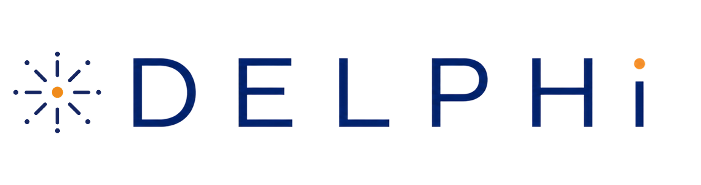
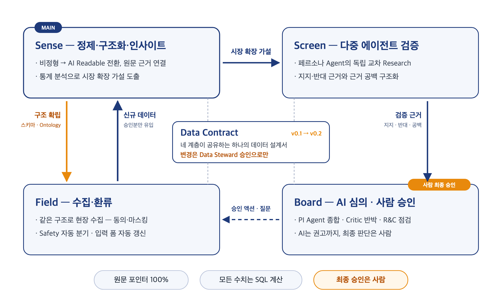

# DELPHi 

  

> Adaptive Data Foundation for Growth Intelligence for XCOPRI®

고대 델포이는 중요한 결정을 앞둔 사람들이 질문을 가져오던 장소였습니다. 
현대의 Delphi method는 불확실성이 큰 문제에서 여러 전문가의 의견을 익명·반복적으로 수집하고 통제된 피드백을 통해 판단을 구조화합니다. 
익명성, 반복, 통제된 피드백과 집단 반응을 Delphi method의 핵심 특성으로 설명합니다.
DELPHi는 여기서 영감을 받아, 흩어진 신호와 서로 다른 관점을 구조화하되 결론만 남기지 않고 근거와 이견까지 추적 가능하게 남깁니다.
> 신탁은 해석을 남겼습니다. DELPHi는 근거를 남깁니다.

DELPHi는 비정형 내부 데이터를 원문 근거가 연결된 AI-readable 데이터로 전환하고, 그 위에서 내부 신호와 외부 과학 근거를 교차검증하는 XCOPRI 매출 성장 플랫폼입니다.

핵심 차별점은 문서를 한 번 분석하는 데 있지 않습니다. 과거 데이터에서 발견한 반복 개념을 사람이 검토할 수 있는 스키마 변경안으로 만들고, 승인된 구조를 향후 현장 데이터 수집에 다시 반영하는 폐쇄형 학습 루프에 있습니다.

## 문제 정의

우리의 핵심 Pain Point는 데이터 부족이 아니라, 현장에서 생성된 의미 있는 신호가 조직의 판단으로 전환되기까지 걸리는 긴 ‘Insight Latency(인사이트 잠복기간)’입니다.

Insight Latency는 기록이 생성된 시점부터 반복성 · 근거 · 우선순위를 갖춘 의사결정 정보로 조직이 인지하는 시점까지의 간격입니다. 

현재는 데이터가 계속 쌓여도 비정형 · 자유서술 형태로 분산되어 있어, 중요한 신호가 발견되고 검증되기까지 많은 시간이 필요합니다.

문제의 핵심은 정보 부족이 아니라, 축적된 비정형 정보가 검증·집계·재사용 가능한 근거로 전환되지 않는다는 데 있습니다. XCOPRI의 다음 성장 신호는 이미 대화·문서·논문·임상 데이터 속에 있습니다. 문제는 그것들이 서로 연결되지 않는다는 것입니다.

## 기대 효과

### Data Latency 70% 이상 단축

Word·Excel·자유서술 형태의 자료를 분석할 때마다 사람이 다시 읽고 분류하는 대신, AI가 Data Contract에 따라 구조화 후보를 생성하고 사용자는 필요한 부분을 검토·승인합니다. 

이를 통해 데이터가 발생한 시점부터 검색·집계 가능한 상태가 되기까지의 시간을 줄이는 것을 목표로 합니다.

### Insight Latency 50% 이상 단축
반복 신호를 사람이 여러 문서에서 다시 찾고, 관련 논문·임상시험·허가자료를 별도로 조사한 뒤 하나의 보고서로 정리하는 과정을 줄입니다. 

구조화된 내부 신호와 외부 근거를 연결해 지지 근거·반대 근거·근거 공백이 포함된 Board-ready Growth Hypothesis를 더 빠르게 준비하는 것을 목표로 합니다.

### 반복적인 데이터 정리·재분류 업무 70% 이상 감소

한 번 승인된 데이터를 재사용하고, 이후 신규 데이터도 동일한 Data Contract에 따라 축적함으로써 같은 정보를 다시 정리하거나 같은 기준으로 재분류하는 작업을 줄입니다. 

특히 정기 보고, 추가 분석, 회의 준비 때 반복되는 자료 취합과 재가공 시간을 절감할 수 있습니다.

## 핵심 구조

**Sense — 구조화**
비정형 문서를 의미 단위로 나누고 정해진 스키마에 맞춰 구조화합니다. 모든 값에는 원문 위치가 함께 저장됩니다. 승인된 데이터만 SQL로 집계해 반복 횟수와 추이를 계산하고, 여기서 성장 가설 후보를 뽑습니다. 기존 스키마로 담기지 않는 개념이 반복되면 자동으로 반영하지 않고 스키마 변경안으로 제안합니다.

**Screen — 근거 검증**
가설을 PubMed, ClinicalTrials.gov, 공개된 허가·안전성 자료와 맞춰봅니다. 역할이 다른 AI 에이전트가 지지 근거와 반대 근거, 그리고 아직 근거가 없는 부분을 각각 정리합니다. 근거 없는 주장이나 허가 범위를 벗어난 단정은 검증 담당 에이전트가 걸러내고 그 기록을 남깁니다.

**Board — 심의와 승인**
관점이 다른 AI 에이전트가 가설을 심의하고 최종 권고를 정리합니다. 사실과 통계, AI의 해석, 전략 제안은 섞지 않고 구분해서 보여줍니다. 승인 권한은 사람에게 있고, 승인·보류·기각과 그 이유는 모두 기록으로 남습니다.

**Field — 현장 수집**
모바일에서 면담 내용을 기록합니다. 동의를 확인한 뒤 녹음이나 텍스트로 기록하면 개인정보를 가린 전사가 만들어지고, 부작용을 시사하는 내용은 일반 분석과 분리해 안전성 경로로 보냅니다. AI가 만든 구조화 후보는 원문 인용과 함께 카드로 보여주고, 사용자가 확인해 승인한 값만 저장됩니다. 입력 항목은 코드에 고정되어 있지 않고 승인된 스키마에서 그때그때 만들어집니다.
   

