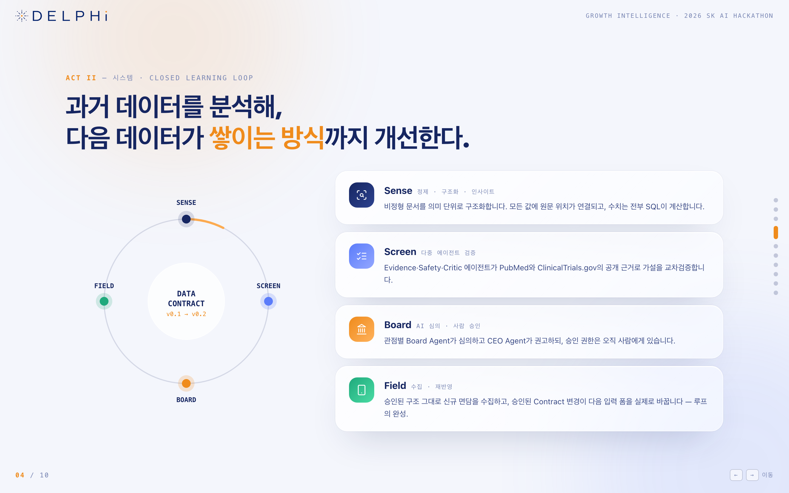
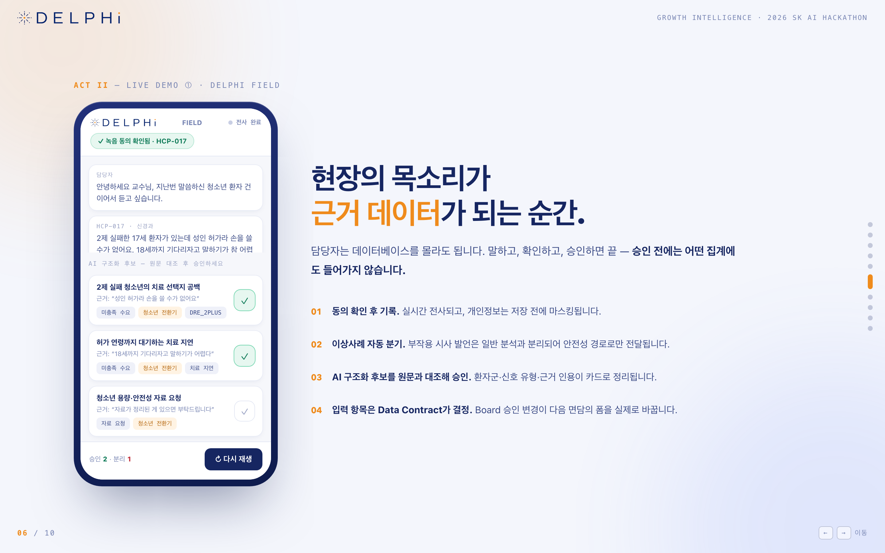
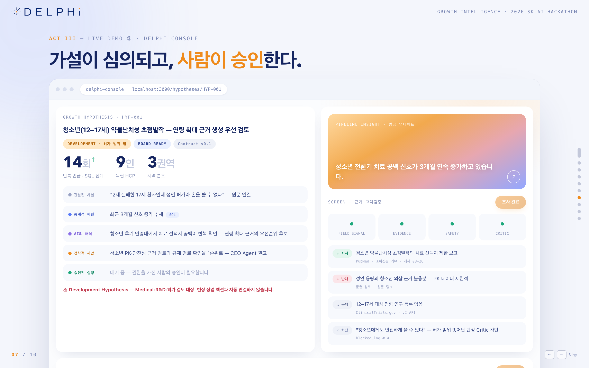

### Sense — 정제 · 구조화 · 인사이트

- 비정형 문서 → claim 후보 추출 (JSON schema structured output)
- 모든 추출값에 evidence pointer 부여 + 원문 substring 검증
- 통제 어휘 정규화 (임상 개념은 MeSH 등 공개 표준 참조, 업무 개념은 자체 vocabulary)
- 검토등급 H/M/L 결정론적 계산 → 사람의 검토·승인
- 승인 데이터의 반복 횟수 · 독립 출처 수 · 추이 SQL 집계 → 성장 가설 후보 생성
- 기존 스키마로 표현되지 않는 반복 개념 → Schema Change Proposal 등록

### Screen — 다중 에이전트 근거 검증

- Field Signal (내부 승인 데이터 SQL 집계 재확인)
- Evidence (PubMed · ClinicalTrials.gov 지지/반대 근거 및 근거 공백)
- Safety · Risk (공개 허가·안전성 자료 대조)
- Critic (근거 없는 주장, 허가 범위 밖 단정, 표본 부족 일반화 차단)
- 에이전트 간 메시지는 자유 대화가 아닌 타입 있는 구조체 (`SUPPORT` / `COUNTER` / `GAP` / `SAFETY_SIGNAL`), 실행 순서는 결정론적

### Board — AI 심의 · 사람 승인

- 관점별 Board Agent 심의 (Medical · Development · Safety · Market Access) + 후속 action item 제안
- CEO Agent 최종 권고, 심의 과정은 회의록으로 기록
- 사람의 승인 · 보류 · 기각과 그 사유를 이력으로 보존
- 승인된 후속 질문은 현장 체크리스트로 환류

### Field — 수집 · 재반영 (모바일 웹)

- 동의 확인 → 텍스트·음성 면담 기록 → PII 마스킹
- 이상사례(AE) 후보 발언 자동 분기 → 별도 safety 경로
- AI 구조화 후보 카드를 원문과 대조해 승인 · 수정 · 제외
- 입력 항목은 하드코딩이 아니라 **활성 Data Contract 버전에서 렌더**
- 방문 전 브리핑 (이전 면담 미해결 질문 + Board 승인 후속 질문)

### Console — 검토 · 가설 · 심의 (웹 대시보드)

- Data Review: 추출값 클릭 → 원문 하이라이트 → 승인 · 수정 · 반려
- Growth Hypothesis Card: 5단계 구분 표시, 지지/반대/공백 근거, 에이전트 활동, Board 회의록
- Data Contract 뷰어 + SCP 검토·승인 + 버전 diff
- 안전성 후보 및 Critic 차단 로그

## 작동 구조



```
과거 비정형 데이터
   └─▶ Sense 구조화 (+ evidence pointer)
          └─▶ 사람 검토·승인 ─── APPROVED만 ───▶ SQL 집계 (반복·출처·추이)
                                                    └─▶ 가설 후보
                                                          └─▶ Screen 교차검증 (외부 공개 근거)
                                                                └─▶ Board 심의 + CEO 권고
                                                                      └─▶ 사람의 승인
                                                                            ├─▶ 후속 액션·질문 → Field
                                                                            └─▶ SCP → Contract v0.2
                                                                                  └─▶ Field 입력 폼 변경
                                                                                        └─▶ 신규 수집 → Sense (루프)
```

### Data Contract

조직이 "어떤 정보를 어떤 항목과 규칙으로 저장할지" 합의한, 시스템이 읽을 수 있는 데이터 설계서입니다. 하나의 정의를 여섯 곳이 공유합니다 — AI 추출 출력 스키마 · 서버 검증 · DB 저장 구조 · Field 입력 폼 · 대시보드 집계 기준 · 에이전트 입력 형식.

AI는 Contract를 자동 변경할 수 없습니다. 변경은 `SCP 등록(원문 사례 + 반복 횟수 + 영향 분석)` → `승인` → `새 버전 ACTIVE, 이전 버전 RETIRED` 순서로만 이뤄지고, 과거 데이터는 생성 당시 버전을 유지합니다.

### Evidence pointer

모든 추출값은 원문 위치를 함께 저장하고, 서버는 인용문이 원문의 substring인지 검증합니다. 검증에 실패하면 저장되지 않습니다.

```json
{ "verbatim_quote": "어르신들은 약이 워낙 많아서 상호작용부터 걱정된다고 하셨다",
  "evidence": { "doc_id": "INT-20250912-001", "char_start": 412, "char_end": 448 } }
```

### 승인 상태 머신

```
CANDIDATE ──승인──────▶ APPROVED ──┐
    ├─────수정 후 승인──▶ APPROVED ──┼──▶ 집계·가설·심의에 사용 (APPROVED만)
    └─────반려────────▶ REJECTED   ┘   (보존하되 집계 제외)
```

검토등급 `HIGH`/`MEDIUM`/`LOW`는 상태가 아니라 참고 라벨이며, `원문 일치 + 용어 매핑 성공 + 규칙 통과` 조합으로 결정론적으로 계산됩니다(모델의 자체 확신도가 아님). HIGH도 자동 승인되지 않습니다.

### In-label / Development 분리

환자군이 허가 범위 밖이면 `label_scope = OUT_OF_LABEL`로 태깅되고, 이를 참조하는 가설은 자동으로 `kind = DEVELOPMENT`가 되어 상업 액션 경로에서 제외됩니다. 화면 표시 규칙이 아니라 데이터·조회 단계의 제약으로 구현합니다.

### 5단계 구분 표시

화면의 모든 판단 정보는 만든 주체로 구분됩니다 — **관찰된 사실**(원문) · **통계적 패턴**(SQL) · **AI의 해석**(LLM) · **전략적 제안**(Board·CEO 권고) · **승인된 실행**(사람). API 응답 구조에도 그대로 반영됩니다.

### 수치 계산 원칙

반복 횟수 · 독립 출처 수 · 빈도 · 추이는 전부 SQL과 결정론적 코드로 계산합니다. LLM은 구조화 · 근거 분류 · 요약 · 가설 생성에만 사용하고, 에이전트는 SQL 결과를 읽기만 합니다.

### 데이터 3계층

| 계층 | 내용 |
|---|---|
| Source | 원본 문서·면담 원문 (불변) |
| Evidence & Structured | 추출 후보 + 원문 위치 + 검토 상태 |
| Analytics & Decision | 승인 데이터 기반 집계 · 가설 · 심의 · 결정 |

이관을 고려해 데이터 계층은 **ANSI SQL 범위**로만 구현합니다. 모든 LLM 호출은 단일 래퍼를 경유하며 model · prompt version · schema · input hash · latency가 기록됩니다.

## 화면

구현 목표 화면의 목업입니다.

<table>
<tr>
<td width="50%"></td>
<td width="50%"></td>
</tr>
<tr>
<td><b>Field</b> — 동의 확인, 실시간 전사, AE 자동 분기, 구조화 후보 승인</td>
<td><b>Console</b> — Growth Hypothesis Card, 5단계 구분 표시, 에이전트 교차검증</td>
</tr>
</table>

인터랙티브 목업: [`demo/Demo_Mockup.html`](demo/Demo_Mockup.html)
